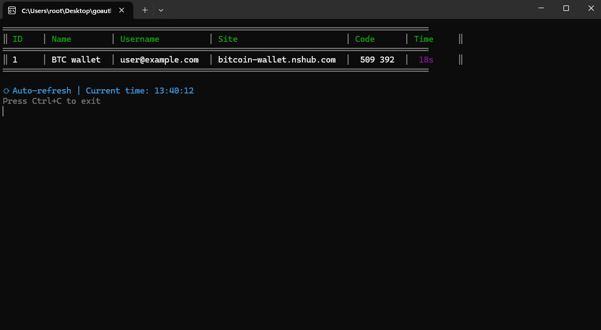

# GoAuth - TOTP Authenticator CLI

A beautiful command-line TOTP (Time-based One-Time Password) authenticator written in Go.

## Features

- 📱 Generate TOTP codes from YAML config
- 🎨 Colorful table display
- ⏱️ Auto-refresh every second
- ⏳ Shows remaining time for each code
- 🔒 30-second TOTP period

## Installation

```bash
go mod download
go build .
```

## Configuration

Edit `config.yml` to add your accounts:

```yaml
accounts:
  - id: 1
    name: GitHub
    username: username
    site: site.com
    secret: JBSWY3DPEHPK3PXP
```

**Note:** Replace the example secrets with your actual TOTP secrets (base32 encoded).

## Usage

Run the application:

```bash
./goauth
```

Or specify a custom config file:

```bash
./goauth myconfig.yml
```

## Display

The app shows a beautiful table with:
- **ID**: Account ID
- **Name**: Account name
- **Username**: Account username
- **Site**: Website/service
- **Code**: 6-digit TOTP code (formatted as XXX XXX)
- **Time**: Remaining seconds (color-coded: red ≤5s, yellow ≤10s, default >10s)

Press `Ctrl+C` to exit.

## Dependencies

- `github.com/pquerna/otp` - TOTP generation
- `github.com/fatih/color` - Colored terminal output
- `gopkg.in/yaml.v3` - YAML configuration parsing


## screenshots
